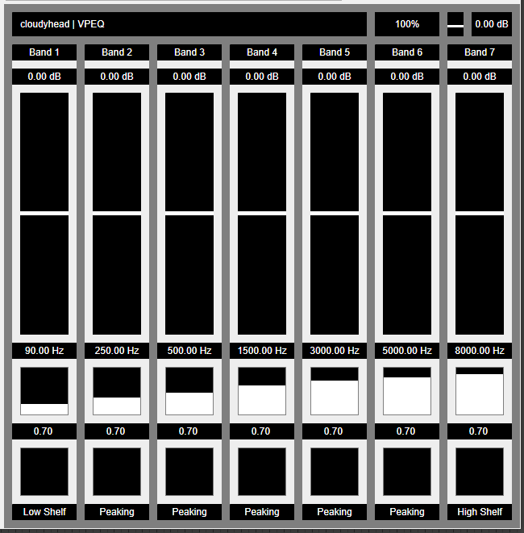

# VPEQ



Use ```git clone --recursive https://github.com/rpuhalovich/VPEQ.git``` to clone.

## Intro

A basic parametric equalizer made using the ASPiK Framework as a personal exercise.

ASPiK: https://www.aspikplugins.com/

The V stands for Veggie.

## TODO

- Add a graphical representation of the frequency response.
- Add AU support.
- Add and try different biquad structures.
- Add and try different filter coefficient algorithms.
